<div align="center">

# 🚕 NYC Taxi Data Lakehouse Pipeline


**End-to-end data lakehouse pipeline** for NYC Green Taxi trip data — fully containerized, zero cloud cost, and built entirely with open-source technologies.

[](https://spark.apache.org/)
[](https://delta.io/)
[](https://airflow.apache.org/)
[](https://min.io/)
[](https://trino.io/)
[](https://www.docker.com/)

</div>

---

## 📋 Overview

This project implements a **Data Lakehouse** using the **Medallion Architecture** (Bronze → Silver → Gold) to process and analyze NYC Green Taxi trip data. The pipeline is orchestrated by Apache Airflow, processes data with Apache Spark + Delta Lake, and serves analytical queries through Trino — all running locally via Docker Compose.

---

## 🏗️ Architecture

```mermaid
flowchart LR
    A["🌐 NYC TLC\nData Source"] --> B["🔄 Apache Airflow\nOrchestration"]
    B --> C["🪣 MinIO\nObject Storage"]
    C --> D["🥉 Bronze\nRaw Parquet"]
    D --> E["⚡ Apache Spark\n+ Delta Lake"]
    E --> F["🥈 Silver\nCleaned Data"]
    F --> E
    E --> G["🥇 Gold\nStar Schema"]
    G --> H["📚 Hive Metastore\nMetadata Catalog"]
    H --> I["🔍 Trino\nSQL Analytics"]

    style A fill:#e94560,stroke:#e94560,color:#fff
    style B fill:#017CEE,stroke:#017CEE,color:#fff
    style C fill:#C72E49,stroke:#C72E49,color:#fff
    style D fill:#cd7f32,stroke:#cd7f32,color:#fff
    style E fill:#E25A1C,stroke:#E25A1C,color:#fff
    style F fill:#c0c0c0,stroke:#c0c0c0,color:#000
    style G fill:#ffd700,stroke:#ffd700,color:#000
    style H fill:#FFA500,stroke:#FFA500,color:#fff
    style I fill:#DD00A1,stroke:#DD00A1,color:#fff
```



| Layer | Description | Format |
|-------|-------------|--------|
| **🥉 Bronze** | Raw data ingested from NYC TLC | Parquet |
| **🥈 Silver** | Cleaned & validated with schema enforcement | Delta Lake |
| **🥇 Gold** | Business-level star schema (fact & dimension tables) | Delta Lake |

---

## 🔄 Pipeline Flow

The Airflow DAG runs **@monthly** with the following task sequence:

```mermaid
flowchart LR
    A["⬇️ Download\nDataset"] --> C["☁️ Upload to\nMinIO"]
    B["📄 Upload\nZone CSV"] --> C
    C --> D["🥉→🥈\nBronze to Silver"]
    D --> E["✅ Validate\nSilver"]
    E --> F["🥈→🥇\nBuild fact_trip"]
    F --> G1["dim_weekday"]
    F --> G2["dim_paymenttype"]
    F --> G3["dim_location"]
    G1 --> H["💬 Slack\nNotification"]
    G2 --> H
    G3 --> H

    style A fill:#017CEE,stroke:#017CEE,color:#fff
    style B fill:#017CEE,stroke:#017CEE,color:#fff
    style C fill:#C72E49,stroke:#C72E49,color:#fff
    style D fill:#E25A1C,stroke:#E25A1C,color:#fff
    style E fill:#c0c0c0,stroke:#c0c0c0,color:#000
    style F fill:#ffd700,stroke:#ffd700,color:#000
    style G1 fill:#ffd700,stroke:#ffd700,color:#000
    style G2 fill:#ffd700,stroke:#ffd700,color:#000
    style G3 fill:#ffd700,stroke:#ffd700,color:#000
    style H fill:#4A154B,stroke:#4A154B,color:#fff
```




---

## 🛠️ Tech Stack

| Component | Technology | Purpose |
|-----------|-----------|---------|
| **Orchestration** | Apache Airflow | Schedule & monitor workflows |
| **Object Storage** | MinIO | S3-compatible data lake storage |
| **Processing** | Apache Spark | Distributed data processing |
| **Table Format** | Delta Lake | ACID transactions on Spark |
| **Metadata** | Hive Metastore | Centralized table catalog |
| **SQL Engine** | Trino | Distributed SQL query engine |
| **Databases** | MariaDB, PostgreSQL | Backend for Hive & Airflow |
| **Infrastructure** | Docker Compose | Containerization (9 services) |

---

## 🚀 Getting Started

### Prerequisites

- **Docker** and **Docker Compose** installed
- At least **8 GB RAM** allocated to Docker

### Quick Start

1. **Clone the repository**

   ```bash
   git clone https://github.com/<your-username>/NYC-Taxi-Pipeline.git
   cd NYC-Taxi-Pipeline
   ```

2. **Start all services**

   ```bash
   make all
   ```

3. **Access the services**

   | Service | URL | Credentials |
   |---------|-----|-------------|
   | Airflow UI | [localhost:8080](http://localhost:8080) | `airflow` / `airflow` |
   | MinIO Console | [localhost:9001](http://localhost:9001) | `minio` / `minio123` |
   | Trino UI | [localhost:8443](http://localhost:8443) | — |
   | Spark Master | [localhost:32766](http://localhost:32766) | — |

4. **Trigger the pipeline** — Open Airflow UI → Enable `nyc_taxi` DAG → Trigger

5. **Stop all services**

   ```bash
   make clean
   ```

---

##  Project Structure

```
NYC-Taxi-Pipeline/
├── docker/
│   ├── airflow/              # Airflow Dockerfile & entrypoint
│   ├── hive-metastore/       # Hive Metastore config
│   ├── spark/                # Spark master & worker
│   └── trino/                # Trino coordinator & worker
├── mnt/
│   └── airflow/
│       ├── airflow.cfg
│       └── dags/
│           ├── nyc-taxi-data-pipeline.py   # Main DAG
│           ├── files/                      # Data files
│           └── scripts/                    # Spark ETL scripts
├── images/                   # Diagrams & screenshots
├── docker-compose.yml        # 9 service definitions
├── Makefile                  # Build & run automation
└── README.md
```

---

## 📄 License

This project is open source and available under the [MIT License](LICENSE).

---

<div align="center">

**Built with ❤️ using open-source technologies**

</div>
